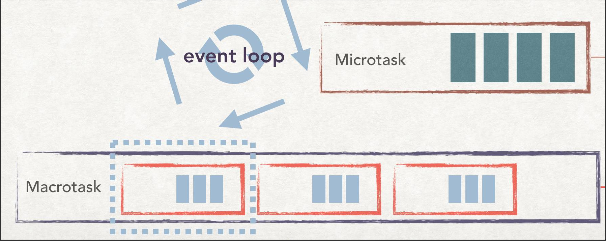
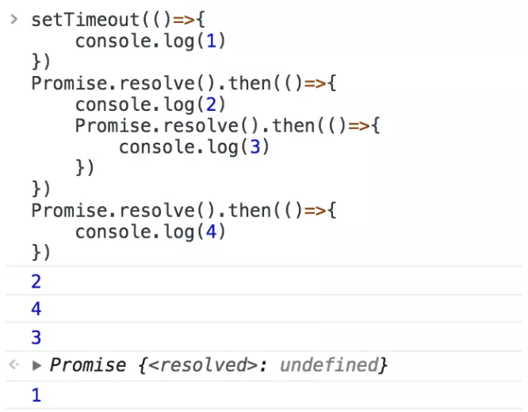

##  一、注意点
1. promise是同步执行的，then是异步的 

2. `宏任务`

   | #                       | 浏览器 | Node |
   | :---------------------- | :----: | :--: |
   | `I/O`                   |   ✅    |  ✅   |
   | `setTimeout`            |   ✅    |  ✅   |
   | `setInterval`           |   ✅    |  ✅   |
   | `setImmediate`          |   ❌    |  ✅   |
   | `requestAnimationFrame` |   ✅    |  ❌   |

3. `微任务`

   | #                            | 浏览器 | Node |
   | :--------------------------- | :----: | :--: |
   | `process.nextTick`           |   ❌    |  ✅   |
   | `MutationObserver`           |   ✅    |  ❌   |
   | `Promise.then catch finally` |   ✅    |  ✅   |

## 二、总结

js是单线程的，处理任务是一件接着一件处理，所以如果一个任务需要处理很久的话，后面的任务就会被阻塞，所以js通过Event Loop事件循环的方式解决了这个问题。

1. js引擎运行时，当代码开始运行的时候，会将代码压入执行栈进行执行（同步）

2. 当遇到异步时，会把任务交给webapi去维护，而执行栈则执行后面的任务，当setTimeout(异步)结束时，会被放入回调队列

   `详细：当执行栈清空时，会执行全部Microtask（微任务）队列中的任务，最后才是取回调队列的第一个Macrotask(宏任务)`

   

3. 当执行栈为空时，异步任务会从回调队列中取出，压入执行栈

4. 重复2、3步骤

   examle：

   上面的执行过程是：

   1，将setTimeout给push进宏任务

   2，将then(2)push进微任务

   3，将then(4)push进微任务

   4，任务队列为空，取出微任务第一个then(2)压入执行栈

   5，输出2，将then(3)push进微任务

   6，任务队列为空，取出微任务第一个then(4)压入执行栈

   7，输出4

   8，任务队列为空，取出微任务第一个then(3)压入执行栈

   9，输出3

   10，任务队列为空，微任务也为空，取出宏任务中的setTimeout（1）

   11，输出1