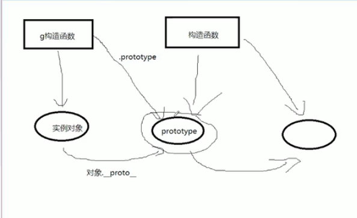

## 1.面向对象编程和面向过程编程

思维方式

面向过程：按步骤，按顺序

面向对象：找到角色确定职责

## 2.this指向问题

this指代是【当前对象】所谓的当前对象，是指，此刻正在执行这个函数的对象，谁调用这个函数，this就指向谁

call/apply   bind

## 3.箭头函数的this

箭头函数没有this，不能作构造函数

setTimeout和setInterval的this指向window

是由于`setTimeout()调用的代码运行在与所在函数`完全分离的执行环境上。这会导致这些代码中包含的 `this` 关键字会指向 `window` (或`全局`)对象。

## 4.eval函数是做什么的

eval() 函数可计算某个字符串，并执行其中的的 JavaScript 代码。

少用，转译处理

requireJS ===> AMD模块化规范的代表作

seaJS ===> CMD

ES6的模块化

## 5.函数防抖

**防抖**：**任务频繁触发的情况下，只有任务触发的间隔超过指定间隔的时候，任务才会执行。**

```javascript
function debounce(callback,delay=300) {
      let t=null
      return function () {
        clearTimeout(t)
        t=setTimeout(callback, delay);
      }
    }
    
    window.onscroll=debounce(function () {
      console.log('调用了')
    })

```


## 6.函数节流

**节流**：**指定时间间隔内只会执行一次任务。**

```javascript
  function throttle(callback, duration) {
    let lasttime=new Date().getTime();
    return function () {
      var now=new Date().getTime()
      if(now-lasttime>100){
        callback();
        lasttime=now
      }
    }
  }

  window.onscroll = throttle(function () {
    console.log('调用了')
  })
```

## 7.作用域链是什么

每一个产生作用域的函数都有一个它自己的作用域对象

## 8.原型链的继承机制



## 9.垃圾回收机制

gc

引用记数法：变量引用数为0就会被清理

标记清除法

（前两种会产生碎片）

标记整理法

复制整理法